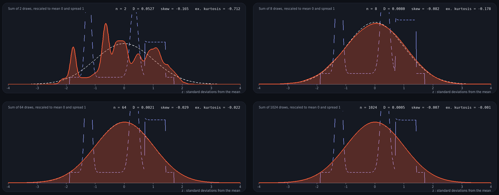

# clt-draw

**Behold the power of the Central Limit Theorem! Convergence to a normal distribution is inevitable, how long can your curve avoid it?**

Draw any curve you like and treat it as a probability density. Lock it in, then add together
n = 2, 4, 8, …, 1024 independent draws from it and watch the density of the sum turn into a bell curve.



A browser version (HTML canvas) lives on my website: **[sarthakdass.github.io](https://sarthakdass.github.io/)** → Projects.

## Run it

```bash
git clone https://github.com/sarthakdass/clt-draw
cd clt-draw
pip install -r requirements.txt
python -m clt_draw            # or: pip install -e . && clt-draw
```

Needs Python 3.9+, `numpy` and `pygame`.

## Use it

| Do this | To |
| --- | --- |
| Drag on the canvas | Draw your density (redraw over a stretch to replace it) |
| **Submit curve** (or Enter) | Lock the curve in and precompute every n |
| Click a tick, or ← / → | Choose n = 2, 4, 8, 16, 32, 64, 128, 256, 512, 1024 |
| **Redraw** (or Esc / R) | Start over |
| Check boxes | Show or hide the standard normal curve and your original curve |

The readout shows the Kolmogorov distance **D** to the normal curve, plus skewness and excess
kurtosis (both 0 for a normal). The small chart plots D against n on a log scale with a dashed
1/√n guide.

## How it works

**Your curve becomes a lattice distribution.** The curve is resampled to $M = 1024$ evenly spaced
points and normalised so the values $p_0,\dots,p_{M-1}$ sum to 1. That is the probability mass
function of one draw $X$, taking the values $k = 0, 1, \dots, M-1$.

**Sums are exact, not sampled.** For independent draws, the mass function of a sum is the
convolution of the individual ones:

$$P(X_1 + X_2 = s) = \sum_k p_k\, p_{s-k} = (p * p)_s .$$

**Doubling saves work.** Rather than convolving one draw at a time (1023 convolutions to reach
$n = 1024$), use

$$p^{*2n} = p^{*n} * p^{*n}, \qquad n = 1, 2, 4, \dots, 512,$$

which takes 10 convolutions: 2 draws, then 2 more combined with them to make 4, then 4 more to make
8, and so on up to 1024. Each convolution is done with the FFT, since the transform of a convolution
is the product of transforms, so squaring the spectrum doubles the number of draws:

$$\widehat{p^{*2n}} = \big(\widehat{p^{*n}}\big)^{2}.$$

The result is exact up to the 1024-point lattice and floating-point round-off.

**Standardise so every n fits on one axis.** A sum of $n$ draws has mean $n\mu$ and standard deviation
$\sigma\sqrt n$, so it keeps spreading out. Rescaling,

$$Z_n = \frac{S_n - n\mu}{\sigma\sqrt n}, \qquad g_n(z) = \sigma\sqrt n \; P(S_n = k)\Big|_{z = (k - n\mu)/(\sigma\sqrt n)},$$

gives every $Z_n$ mean 0 and variance 1, so it can be compared with the standard normal density
$\varphi(z) = e^{-z^2/2}/\sqrt{2\pi}$.

**The Central Limit Theorem** says $Z_n \Rightarrow N(0,1)$ for any curve with finite variance.

**How fast?** The readout reports the Kolmogorov distance

$$D_n = \sup_z \lvert F_n(z) - \Phi(z) \rvert,$$

and the Berry–Esseen theorem bounds it by $C\,\rho/(\sigma^3\sqrt n)$ with $\rho = \mathbb E|X-\mu|^3$,
which is why the dashed guide in the chart falls like $1/\sqrt n$. Cumulants add under independent
sums, so skewness and excess kurtosis shrink *exactly* like

$$\gamma_n = \frac{\gamma_1}{\sqrt n}, \qquad \kappa_n = \frac{\kappa_1}{n},$$

and the code checks that in its tests.

## Project layout

```
clt_draw/core.py   the mathematics: lattice, doubling convolution, standardising, distances (numpy only)
clt_draw/app.py    the Pygame interface
tests/             pytest suite for the core (doubling vs. direct convolution, exact skew/kurtosis scaling, ...)
docs/              screenshots
```

```bash
pip install pytest && pytest
```

## Credit

The idea for this project is not original. An anonymous student from Professor Dan Ostrov's Probability class designed a similar website, and I took inspiration in designing my own visually interactive Central Limit Theorem project.
